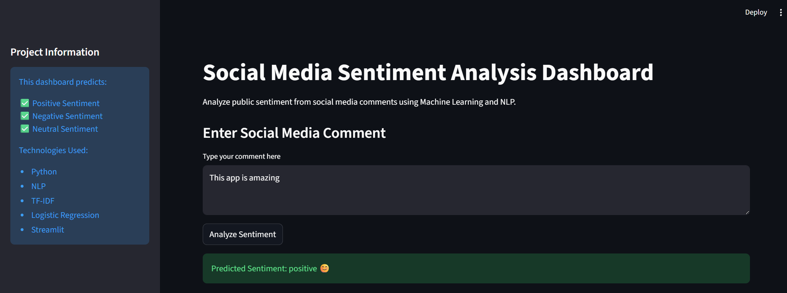
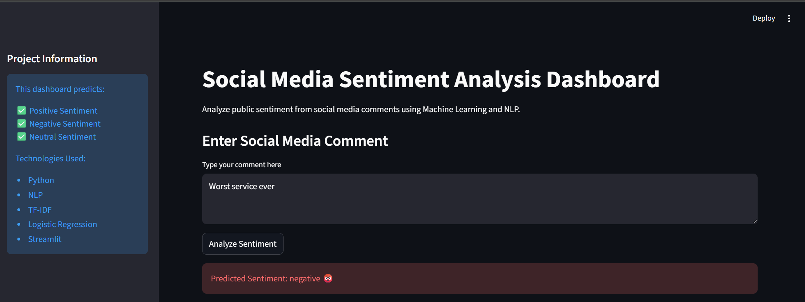

# Social Media Sentiment Analysis Dashboard


## Negative Prediction



---

# Machine Learning Workflow

```text
Social Media Comments
        ↓
Text Cleaning
        ↓
NLP Preprocessing
        ↓
TF-IDF Vectorization
        ↓
Logistic Regression Model
        ↓
Sentiment Prediction
        ↓
Dashboard Visualization
```

---

# Future Improvements

- Twitter API integration
- Deep Learning model
- BERT sentiment analysis
- Multi-language support
- Live analytics

---

# Learning Outcomes

This project helped in understanding:

- NLP preprocessing
- Text vectorization
- Machine Learning classification
- Dashboard development
- Data visualization
- GitHub project deployment

---

# Author

Bablu Shaw

Student | Machine Learning Enthusiast | NLP Learner
